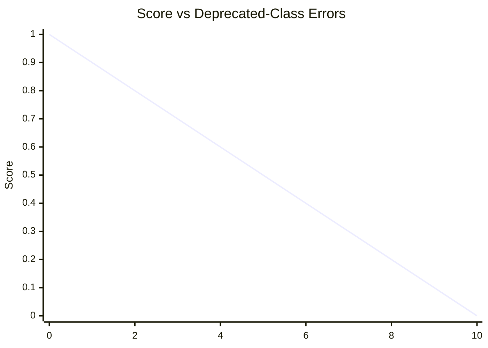

# Design System Component Coverage Plugin

The goal of this plugin is to measure the correct usage and implementation of the design system components.
It makes sure that the components replace legacy components with design system components.

## Setup

`code-pushup.config.ts`

```ts
import { dsComponentCoveragePluginCoreConfig } from './src/index.ts';

export default dsComponentCoveragePluginCoreConfig({
  directory: 'angular-project/src',
  dsComponents: [
    {
      className: 'DsButton',
      deprecatedClassNames: ['btn']
    }
  ],
})
```

In the folder where the config is run `npx @code-pushup/cli`.

## Audit - DS Component Coverage

This audit checks all components for the usage of specific legacy classes and provides actionable feedback on how to replace them.

**Audit Slug**: `component-coverage-<component-name>` - e.g. `component-coverage-ds-button`
**Score:**  The score is binary and indicates if all definitions of legacy classes are removed from the codebase.
**Issue Severity:** Warning

The plugin supports 2 issues:
- `` - class definition issues
- `` - class usage issues

### Examples

#### Plugin Config Example

```ts
import dsComponentCoveragePlugin from './ds-component-coverage.plugin';

export default {
  plugins: [
    dsComponentCoveragePlugin({
      directory: 'my-app/src',
      dsComponents: [
        {
          className: 'DsButton',
          deprecatedClassNames: ['btn']
        },
        {
          className: 'DsButtonDropDown',
          deprecatedClassNames: ['btn-dropdown']
        }
      ],
    })
  ]
}
```

#### Checked Files Example

```bash
root
┇
┣━━ 📂my-app/src
    ┣━━ button/button.component.ts
    ┃   ├╼ styles: [ ]
    ┃   │           └╼ [0] `.btn { color: red; }`
    ┃   └╼ template: `<button class="btn>push the btn</button>`
    ┣━━ button-dropdown/button-dropdown.component.ts
    ┃   ├╼ styleUrls: [ ]
    ┃   │              └╼ [0] `./button-dropdown.component.css`
    ┃   └╼ templateUrl: `./button-dropdown.component.html`
    ┇
```

#### Deprecated Classes Usage in DS Component

This example showcases the usage of a deprecated classes in `button/src/button.component.ts`.

_button.component.ts_

```ts
@Comment({
  selector: 'bet-slip',
  styles: [`
    /* ❌ definition of legacy class 'btn' use 'ds-button' component instead */
    .btn {
      color: red;
    }
 `],
  template: `...`
})
```

_button-dropdown.component.css_

```css
/* ❌ definition of legacy class 'btn' use 'ds-button' component instead */
.btn-dropdown {
  color: red;
}
```

_button-dropdown.component.ts_

```ts
@Comment({
  selector: 'button-dropdown',
  styles: [`./button-dropdown.component.css`],
  template: `...`
})
```

#### Deprecated Classes Usage in DS Component Issues

```md
|  Severity  | Message                                                                                                                                                                                                                                                                                   | Source file                                                                                                                                                                                       | Line(s) |
|:----------:| :---------------------------------------------------------------------------------------------------------------------------------------------------------------------------------------------------------------------------------------------------------------------------------------- | :------------------------------------------------------------------------------------------------------------------------------------------------------------------------------------------------ | :-----: |
| 🚨 _error_ | ✏️🔲  Element <code>button-dropdown</code> in attribute <code>class</code> uses deprecated class <code>btn</code>. Use <code>DSButton</code> instead. <a href="https://storybook.entaingroup.corp/latest/?path=/docs/components-button--overview" target="_blank">Learn more</a>.         | [`./src/app/app.component.ts`](./src/app/app.component.ts)    |   23    |
| 🚨 _error_ | ✏️🎨️ The selector's class <code>btn</code> is deprecated. Use <code>DSButton</code> and delete the styles. <a href="https://storybook.entaingroup.corp/latest/?path=/docs/components-button--overview" target="_blank">Learn more</a>.                                                    | [`./src/app/components/bad-alert.component.ts`](./src/app/components/bad-alert.component.ts)  |  9-11   |
```

#### Deprecated Classes Definition in DS Component

This example showcases the usage of a deprecated token in `button/src/button.component.ts`.

_button.component.ts_

```ts
@Comment({
  selector: 'bet-slip',
  styles: [`
    /* ❌ definition of legacy class 'btn' use 'ds-button' component instead */
    .btn {
      color: red;
    }
 `],
  template: `...`
})
```

_button-dropdown.component.html_
```html
<!-- ❌ usage of legacy class 'btn-dropdown' use 'ds-button' component instead -->
<select class="btn-dropdown">
  <options>...</options>
</select>
```

_button-dropdown.component.ts_
```ts
@Comment({
  selector: 'button-dropdown',
  template: `
  <!-- ❌ usage of legacy class 'btn' use 'ds-button' component instead -->
  <button class="btn">...</(button>
  `,
  template: `...`
})
```

**Resulting Issues:**

```md
|  Severity  | Message                                                                                                                                     | Source file                                                                                                                                                                                                          | Line(s) |
|:----------:|:-----------|:-|:------:|
| 🚨 _error_ | 🎨 ????????? | [`button.component.ts`](./button.component.ts) |  4-20   |
| 🚨 _error_ | 🎨 ????????? | [`button.component.html`](./button.component.html) |  4-20   |
```

## Scoring (Design-System Coverage Errors Only)

Each component (or file selection) is graded against a simple **error budget**:  
no warnings, no weighting—only the number of deprecated-class errors found.

---

### Scoring Parameters

| **Parameter** | **Description**                                            |
|--------------:|------------------------------------------------------------|
| `E`           | Count of deprecated-class **errors** (🚨)                  |
| `L`           | Allowed error budget (e.g. `L = 10`)                       |

---

#### Coverage score

$`
\mathrm{dsScore} =
\begin{cases}
1, & E = 0\\[6pt]
\max\!\bigl(0,\;1 - \tfrac{E}{L}\bigr), & E > 0
\end{cases}
`$

If `E` equals or exceeds `L`, the score bottoms out at `0`.


